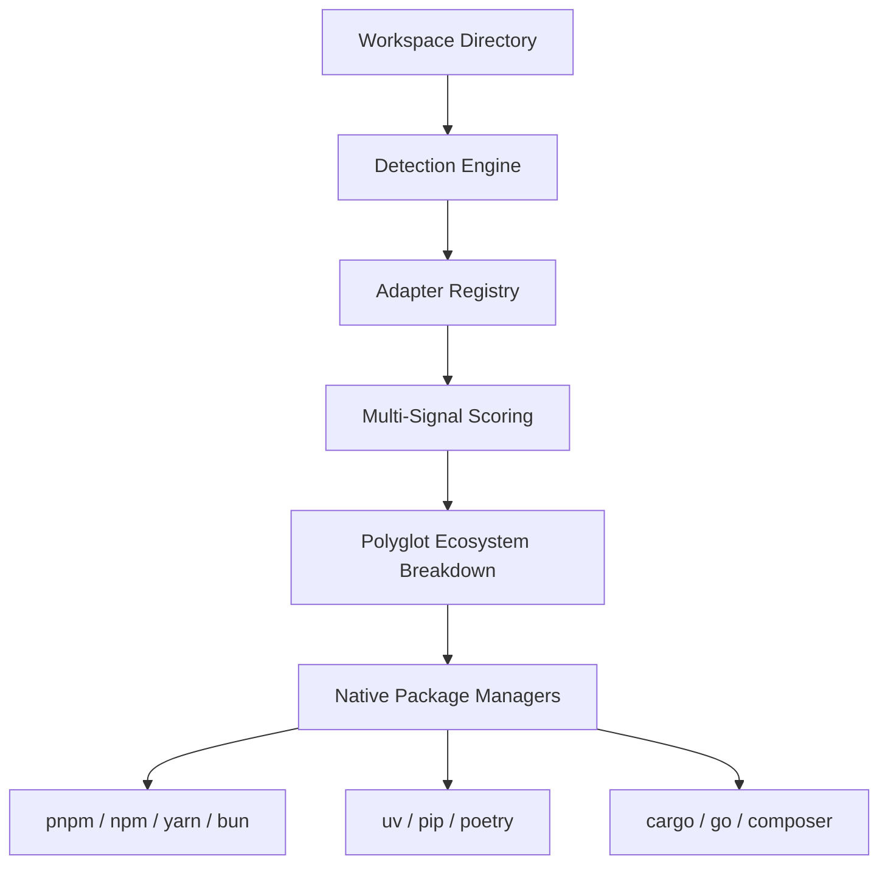

# UPM Architecture Specification

This document details the architectural design of **UPM (Universal Package Platform)**, covering both **L2 Acquisition** and **L2' Invocation**.

---

## 1. L2 Universal Acquisition Engine

The Acquisition Engine detects, configures, and manages package manager operations across 13 language ecosystems without introducing custom package repositories.



### Detection Scoring Engine
The scoring engine evaluates the presence of files, markers, and patterns to assign a deterministic numerical score:

| Signal | Score | Description | Example |
| :--- | :--- | :--- | :--- |
| **Lockfile Present** | `+100` | Ecosystem-specific lockfile | `pnpm-lock.yaml`, `uv.lock`, `Cargo.lock` |
| **Manifest Marker** | `+80` | Specific marker inside manifest | `[tool.poetry]`, `[package]` |
| **Manifest Present** | `+40` | Standard manifest file | `package.json`, `pyproject.toml`, `Cargo.toml` |
| **Glob Match** | `+30` | File extension or pattern match | `*.csproj`, `Gemfile` |
| **Directory Indicator**| `+20` | Output/dependency folder | `node_modules`, `.venv`, `target` |
| **Declared Priority** | `+0..4` | Tie-breaker priority | `pnpm` (4) vs `npm` (1) |

- **Language Grouping**: Ecosystems are grouped by language.
- **Winner Determination**: The adapter with the highest score within a language group wins.
- **Polyglot Retention**: Winners across distinct language groups are all retained.

---

## 2. L2' Invocation Engine (`upm-bridge/1`)

The invocation engine bridges runtime boundary calls between host environments (Python, Node.js, Rust, Go) over standard input/output (stdio) streams.

```text
+-----------------------+                    +-----------------------+
|  Host Process (Rust)  |  --- stdio RPC --> |  Host Process (Node)  |
|                       |  <-- upm-bridge/1  |                       |
+-----------------------+                    +-----------------------+
```

### Key Components
1. **Length-Prefixed Framing Reader/Writer**: Ensures packet boundaries are framed with a 4-byte Big-Endian uint32 header.
2. **Handle Registry**: Tracks local object references (`$ref`) and callback closures (`$fn`) with batched release cycles.
3. **Host Supervisor**: Spawns language processes (`python_host.py`, `node_host.js`) and monitors stdio streams.
